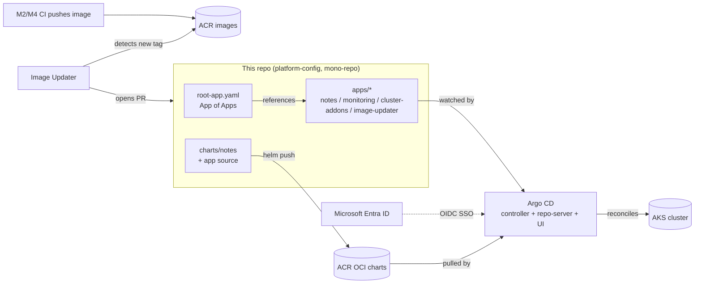

# Azure S1 — ArgoCD GitOps for AKS

Replaces the imperative `helm upgrade` deploys of [M2](https://github.com/i-robert2/azure-m2-ghactions-aks) / [M2.5](https://github.com/i-robert2/azure-m2.5-azure-devops) / [M4](https://github.com/i-robert2/azure-m4-jenkins-aks) with a **declarative GitOps** model. **Argo CD** runs on M1's AKS cluster, watches this repo, and continuously reconciles the cluster to match Git. One **App-of-Apps** root bootstraps three child `Application`s — the **notes app** (from an **OCI Helm chart in ACR**), **kube-prometheus-stack**, and **cluster add-ons** (ingress-nginx + cert-manager). Login is **Entra ID OIDC SSO** with group-based RBAC; **Argo CD Image Updater** opens a **pull request** on this repo whenever CI pushes a new image tag.

> Built as a hands-on learning project. Deployed for real on M1's AKS (swedencentral): Argo reconciled all apps to `Synced + Healthy`, self-heal reverted a manual `kubectl delete`, the Image Updater PR flow bumped a tag, and Entra SSO gated the UI — then torn down. This is the **pull-based** counterpart to the push-based CI of M2/M2.5/M4: the same release, now delivered by Git reconciliation instead of a pipeline `helm upgrade`.

---

## Architecture



---

## How it works

| Concern | Mechanism |
|---|---|
| Bootstrap | **App-of-Apps** — one `root-app.yaml` renders every child `Application` under `platform/apps/` |
| Desired state | Git is the single source of truth; `platform/apps/*/application.yaml` |
| Reconciliation | `syncPolicy.automated` with **prune + selfHeal** — drift is corrected within ~1 min |
| App chart | notes chart pushed to **ACR as an OCI Helm chart**, referenced `oci://acrm1devsdc001.azurecr.io/charts/notes` |
| Image promotion | **Image Updater** watches ACR tags → **opens a PR** on this repo bumping `api.tag`/`frontend.tag`; merge to deploy |
| Access | **Entra ID OIDC SSO**; `admin` group can sync, `viewer` group is read-only (`sync` denied) |
| Guardrails | An **AppProject** restricts allowed source repos, destinations, and resource kinds |

---

## What gets created

On top of M1's base (re-applied, state key `s1.tfstate`): **Argo CD** as a Helm release in the `argocd` namespace (controller, repo-server, applicationset-controller, redis, server/UI behind ingress-nginx with a Let's Encrypt cert), the **App-of-Apps** root plus four child `Application`s, an **AppProject** (`platform`) that whitelists source repos/destinations, **Argo CD Image Updater**, and an **Entra ID app registration** for OIDC SSO (client secret stored only in `argocd-secret`). The notes Helm chart is pushed to **ACR as an OCI artifact**; ingress-nginx, cert-manager, and kube-prometheus-stack become **Argo-managed** (adopted from M1/M3).

---

## Repository layout

```
argocd/values.yaml                     Argo CD Helm install values (ingress + TLS, OIDC SSO, RBAC)
platform/projects/platform.yaml        AppProject — allowed source repos, destinations, roles
platform/root/root-app.yaml            the App of Apps (watches platform/apps, recurse)
platform/apps/cluster-addons/          ingress-nginx + cert-manager Applications
platform/apps/monitoring/              kube-prometheus-stack Application
platform/apps/notes/                   the notes app (OCI chart) + Image Updater annotations
platform/apps/image-updater/           Argo CD Image Updater Application
app/                                   M1 app source (built by CI, deployed by Argo)
charts/notes/                          M1 Helm chart — OCI-pushed to ACR, referenced by Argo
terraform/                             M1 base, state key s1.tfstate
ARGOCD-vs-FLUX.md                      pull-based (Argo) vs the push-based CI of M2/M2.5/M4
```

> The Entra OIDC **client secret** and the Image Updater **git deploy key** are **gitignored** — only public config is committed.

---

## Prerequisites

- M1 base re-applied in swedencentral (AKS/ACR/KV/PG) + ingress-nginx + cert-manager + a ClusterIssuer, and the ingress LB IP (for the `*.sslip.io` hosts).
- **kubectl**, **Helm**, **Azure CLI**, **Terraform**, and the **Argo CD CLI** (`argocd`).
- Permission to create an **Entra ID app registration** in the tenant (for SSO).

---

## Setup

**1 — Infra**
```bash
cd terraform
terraform init -backend-config=backend.hcl
terraform apply
az aks get-credentials -g $(terraform output -raw resource_group) -n $(terraform output -raw aks_name)
IP=$(kubectl get svc ingress-nginx-controller -n ingress-nginx -o jsonpath='{.status.loadBalancer.ingress[0].ip}')
```

**2 — Push the notes chart to ACR as OCI**
```bash
ACR=$(terraform -chdir=terraform output -raw acr_name)
az acr login -n $ACR
helm package charts/notes && helm push notes-0.1.0.tgz oci://$ACR.azurecr.io/charts
```

**3 — Install Argo CD (ingress + TLS)** — render the host, then install:
```bash
sed "s|REPLACE_ARGOCD_HOST|argocd.${IP//./-}.sslip.io|g" argocd/values.yaml > argocd/values.rendered.yaml
helm repo add argo https://argoproj.github.io/argo-helm && helm repo update
kubectl create namespace argocd
helm upgrade --install argocd argo/argo-cd -n argocd -f argocd/values.rendered.yaml --wait
# initial admin password:
kubectl -n argocd get secret argocd-initial-admin-secret -o jsonpath='{.data.password}' | base64 -d
```

**4 — Bootstrap the App-of-Apps**
```bash
kubectl apply -f platform/projects/platform.yaml
kubectl apply -f platform/root/root-app.yaml
argocd app list        # root spawns notes / monitoring / cluster-addons / image-updater
```

**5 — Entra SSO** — register the app, store the secret, patch `argocd-cm`/`argocd-rbac-cm` (see [walkthrough](#) / `argocd/values.yaml`), then `kubectl rollout restart deploy/argocd-server -n argocd`.

**6 — Image Updater** — add the ACR pull secret + git deploy key so it can open PRs; push a new image via M2/M4 CI and watch the PR appear.

---

## Reusability — what to change

| Change | Where |
|---|---|
| Cluster/ACR/RG names | `terraform/`, `platform/apps/*/application.yaml` |
| Hostnames | `REPLACE_ARGOCD_HOST` + `*.sslip.io` values in the Applications |
| Allowed repos / destinations | `platform/projects/platform.yaml` |
| SSO groups (viewer/admin) | `argocd-rbac-cm` policy + Entra group object IDs |
| Image update strategy | `argocd-image-updater.argoproj.io/*` annotations on the notes Application |

---

## Security notes

- **Git is the source of truth** — every change is a reviewable commit/PR; no click-ops, no laptop `helm upgrade` (Argo reverts drift).
- **Least-privilege AppProject** — source repos, destination namespaces, and resource kinds are explicitly whitelisted.
- **SSO, not shared admin** — Entra OIDC with group-based RBAC; `viewer` can read but not `sync`. The `admin` local account is disabled after SSO is verified.
- **No secrets in Git** — the OIDC client secret lives only in `argocd-secret`; the Image Updater git key is a gitignored deploy key.
- **Image Updater PRs, not auto-push** — tag bumps land as reviewable pull requests, not silent commits to `main`.
- **Signed images still enforced** — the Kyverno cosign policy from M2/M4 keeps rejecting unsigned images regardless of who deploys.

---

## Best practices demonstrated

- **Pull-based GitOps** — the cluster pulls desired state from Git; CI never needs cluster credentials.
- **App-of-Apps** — one root bootstraps the whole platform; adding an app = one file + a commit.
- **Self-heal + prune** — continuous reconciliation eliminates configuration drift.
- **OCI Helm charts** — charts versioned and stored in the same registry as images.
- **Automated image promotion with a review gate** — Image Updater PRs.
- **SSO + RBAC** — enterprise identity instead of a shared password.

---

## Real-world scenarios where this pattern applies

- **Platform / SRE teams** running many clusters — Git is the fleet's control plane; ArgoCD ApplicationSets fan out to N clusters.
- **Regulated environments** — every production change is an auditable, reviewed Git commit; the cluster can't drift silently.
- **Separation of duties** — developers push code + images; a GitOps controller (not a human) deploys; reviewers approve the promotion PR.
- **Disaster recovery** — a rebuilt cluster re-bootstraps its entire state from Git by applying one root app.

---

## Issues we hit (and the fixes)

Real problems encountered bringing this up end-to-end:

| # | Symptom | Root cause | Fix |
|---|---------|-----------|-----|
| 1 | `notes` app: `cannot get digest ... 401` | Argo CD's OCI Helm `repoURL` must **not** carry the `oci://` scheme — with it, Argo mis-parsed the repo | Use the bare `acrm1devsdc001.azurecr.io/charts` in the app + AppProject + repo secret |
| 2 | Image Updater can't write tags to a pure-OCI-chart app | Git write-back needs a **git-tracked** values file, not chart-inline values | Refactor `notes` to a **multi-source** app: OCI chart + `$values` git ref → `platform/apps/notes/values.yaml` |
| 3 | cert-manager + monitoring stuck `OutOfSync` (empty diff) | cert-manager's cainjector writes the webhook `caBundle`; the prometheus-operator mutates its own CRs — Argo sees controller-owned fields as drift | `ignoreDifferences` (managedFieldsManagers) + `ServerSideApply`. **Still shows OutOfSync in this version** — a known cosmetic Argo behavior; both apps are Healthy and functional |
| 4 | Image Updater: `denied ... authentication required` listing ACR tags | ACR's `/v2/tags/list` requires the **`metadata_read`** scope (not the standard `pull`); Image Updater's request resolves to anonymous/`pull` → denied. Scoped token, `secret:`/`pullsecret:` creds, and even ACR **anonymous pull** (after a Basic→Standard SKU bump) all failed to lift it | **Unresolved** — a documented Argo CD Image Updater ↔ ACR friction point. Image Updater is installed and fully wired (multi-source values, SSH deploy-key write-back to a PR branch); only the ACR tag-poll is blocked. Registries with a standards-compliant `tags/list` (GHCR, Docker Hub, Quay) work out of the box |
| 5 | Browser: `ERR_SSL_VERSION_OR_CIPHER_MISMATCH` on the sslip.io host | **Client-side** TLS interception (AV/proxy) — the ingress serves a valid Let's Encrypt cert and negotiates TLS 1.2 **and** 1.3 fine from `curl`/other clients | Use an incognito window / disable AV HTTPS scanning. Server side is unaffected |

> Takeaways: Argo OCI charts want a bare `repoURL`; Image Updater on a chart-source app needs a git values file (multi-source); and **Image Updater + Azure Container Registry** has a real tag-listing auth quirk worth knowing before you pick it for an ACR-only shop.

---

## Cost

Argo CD runs on M1's existing nodes (controller + repo-server + redis + UI, ~3–4 small Pods, CPU/memory already paid for). ACR OCI chart storage is <0.01 €/mo; the Entra app registration is free. **~0–2 €/mo added on top of M1.** A deploy-verify-destroy session is ~€2–3. `helm uninstall argocd -n argocd`, then `terraform destroy` returns spend to ~€0.

---

## License

MIT — see [LICENSE](LICENSE).
